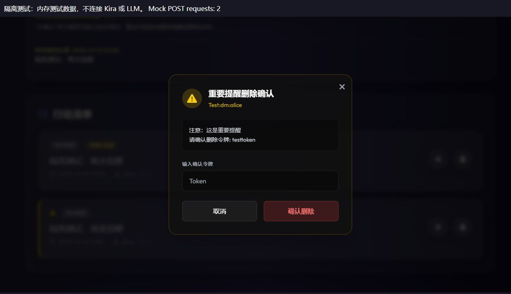

# 插件前端检查记录

日期：2026-10-03。范围：插件页面、前端逻辑与测试；不修改主项目，不修改 LLM 输入缓存，不操作真实提醒，不重启服务。

## 已处理的问题

- **确认按钮无反应**：主 WebUI 的 iframe 没有 `allow-modals`，原生 `window.confirm()` 无法可靠使用。投递重试、忽略和删除改用页面内确认框；取消不发请求。
- **旧会话数据串入新会话**：切换或编辑会话立即清空旧数据和确认框，异步响应按会话及请求序号校验；确认操作绑定打开时的会话和目标。
- **重复提交**：写请求期间统一禁用操作和会话切换；前端锁不等于跨浏览器、跨客户端的后端幂等保护。
- **错误显示为无数据**：校验响应格式，区分读取失败和空列表；读取请求超时显示错误。投递状态不可获取时，活跃数量显示未知。
- **提交结果不明**：失败时不自动重复写请求；暂停进一步操作，提示刷新核对，避免重复投递。
- **筛选与统计不一致**：用户筛选同步应用于投递异常列表，数量反映当前筛选；“全网域”改为“本会话全部”。
- **交互与可访问性**：移除模板中不可靠的延时失焦逻辑，确认框支持 Esc、Tab 焦点约束、取消后恢复焦点及长内容滚动；新增文案有插件内中英文对照。
- **初始化错误不明确**：桥接初始化失败/超时显示错误；Vue 外提供静态加载提示，避免资源失败时完全无说明。

重要提醒的后端令牌校验保持不变；没有放宽主项目 iframe 沙箱。

## 验证结果

- Python：118 项通过；1 条 Starlette 测试客户端依赖弃用警告，未涉及此次功能。
- Node：17 项通过，覆盖确认/取消、重复点击、会话切换、过期响应、令牌删除、筛选、错误/超时、初始化及新增中英文键一致性。
- 实际 Vue 页面：隔离测试服务器使用与主 WebUI 相同的沙箱和内存模拟接口。已验证选择会话、重试打开/取消（模拟 POST 为 0）、确认重试（仅 1 次 POST，显示等待模型处理）、重要提醒删除进入令牌确认且取消后保留提醒。
- 隔离浏览器记录到 Tailwind CDN 的生产使用警告；还出现来源未标明的 MutationObserver 错误，未定位其来源，不能据此断言属于插件。未观察到 Vue 模板编译或插件事件处理错误。
- `git diff --check` 无格式警告。

### 重启后的真实页面检查

用户重启并在浏览器登录后，实际主 WebUI 页面已加载新版脚本。已验证会话选择、读取列表、重试/忽略/删除的确认框打开与取消、用户筛选及手动扫描刷新。刷新后仍有 4 条提醒、1 条未确认投递；个人筛选为 3 条，自主意图筛选为 1 条，投递异常跟随筛选。

未确认真实重试、忽略或删除，也未暂停/恢复任务，因此没有执行真实写操作。浏览器当前页面日志只出现 Tailwind CDN 生产使用警告，未观察到错误级日志。真实写操作完整链路仍需按需验收；重要令牌和确认后的提交逻辑已由隔离测试覆盖。

## 尚未解决或未完整验证

1. Vue、Tailwind、字体和图标仍依赖外部 CDN；静态提示仅改善故障说明，不消除网络依赖。建议后续固定版本并本地化资源。
2. 原有页面多数文案仍为中文；新增提示已双语，完整国际化和主题适配另行规划。
3. 页面仍以手动扫描刷新为主；LLM 或调度器更新后，需要扫描才能及时反映。可后续增加有界、只读刷新，避免覆盖正在确认的操作。
4. 未全面验证手机断点、全部浏览器及辅助技术；当前只改善弹窗滚动和提示宽度。实际 Codex 窄侧栏发现布局问题：iframe 可用宽度 330px，页面内容宽度 368px，扫描按钮向右溢出。确认框在该宽度能正常显示和取消；顶部布局应另做小范围响应式修正，不能据此认为手机布局已完整通过。
5. 前端防重复不能解决多标签页并发；后端全局幂等、跨客户端竞争应作为独立需求评估。

## 用户重启后的验收

1. 重启 Kira，再对插件页面执行 Ctrl+F5。
2. 点击“重试”或“忽略此次”，应出现页面内确认框；先取消，记录应保持不变。
3. 确需处理真实记录时再确认。重试可能重复消息或动作，先检查该提醒是否已经执行。
4. 切换会话、筛选用户和扫描，检查列表与数量一致；重要提醒删除仍应要求令牌。

提交及推送由用户确认后进行；此次没有自动提交。

## 2026-10-04：操作后跳到页面顶部

原因：此前前端提交 `91dab46` 在每次刷新时清空列表，并无条件显示加载占位，导致页面高度瞬间缩短，浏览器收缩滚动范围。另外，确认框恢复焦点未禁止滚动，普通操作也可能恢复之前弹窗遗留的焦点。

修复边界：只调整插件前端与隔离测试，不修改主项目、LLM 输入缓存、提醒权限、确认流程或后端接口。

- 同会话刷新保留上次列表，新提醒和投递状态读取完成后一起更新；刷新期间仍禁用写操作。
- 初次加载或切换会话仍清空旧列表；读取失败仍显示错误并禁用操作，不能把旧数据当成最新可操作数据。
- 弹窗焦点移动使用 `preventScroll`；仅真实弹窗恢复原触发按钮，提交完成并解锁后再恢复，不复用旧焦点。
- 数据删除、筛选或错误提示导致实际布局变化时，浏览器仍可能正常调整位置；本次修复不是强制锁定所有页面滚动。

验证：插件 Python 220 项、Node 22 项通过，包含同会话刷新保留列表、失败清空、过期响应、焦点恢复与令牌弹窗切换；Python 有一条既有 Starlette 弃用警告。

隔离浏览器使用 30 条内存模拟提醒，每次读取延迟 600ms。在固定 315px 视口下，列表中部暂停、恢复、打开与取消删除确认框，滚动位置始终为 4622px；刷新期间和完成后均保留 30 张卡片，取消确认没有新增模拟写请求。未执行真实投递或删除，未重启 Kira。浏览器再次记录到来源未标明的 MutationObserver 错误，尚不能归因于插件；未观察到本次操作相关的 Vue 模板或事件错误。

真实页面验收：按当前部署方式重载插件或重启 Kira 后，Ctrl+F5 刷新页面；在列表下方暂停/恢复一条普通提醒，并打开后取消删除确认框，检查不再因刷新跳到顶部。

## 2026-10-04：快速操作导致通知堆叠

用户反馈：重启后简单测试正常，但快速暂停／恢复会产生较多通知，遮挡页面。此次只调整插件通知展示及测试，不修改后端、主项目、LLM 提示词或输入缓存。

- 最多同时显示 3 条，保留原有约 4 秒自动消失；提供独立 × 按钮，中英文标签一致，支持键盘操作。
- 仅标题、正文和类型完全相同的通知合并，并从最后一次出现重新计时；暂停和恢复等不同结果不因标题相同而合并。
- 满额时优先替换最早的非错误提示；成功提示不挤掉错误提示。全部为错误时，新成功提示不加入，新错误替换最早错误。
- 关闭、替换和页面卸载会清理对应定时器；过期的旧回调不能关闭已续时的通知。关闭只隐藏通知，不撤销操作、不改提醒数据、不发送请求。
- 移除通知列表的退出动画，避免快速替换时旧元素短暂残留、实际显示超过上限。提醒列表和确认框不受影响。

验证：Node 32 项通过，覆盖上限、合并／续时、不同操作、关闭副作用、错误优先级、卸载及模板双语标签。隔离真实 Vue 页面连续操作 4 条内存提醒，立即显示 3 条通知；点击 × 后立即剩 2 条，模拟 POST 数保持 4。没有操作真实提醒或调用 Kira／LLM，没有重启服务或自动提交。

生效方式：按当前部署方式重载插件或重启 Kira，再 Ctrl+F5 刷新插件页面。日常使用时可顺手检查快速操作的通知上限和 × 关闭效果，无需另做复杂测试流程。

### 通知关闭按钮悬停出现白色区域

用户截图反馈 × 悬停时出现半透明白色区域。代码中确定存在 `hover:bg-white/10` 的按钮白底，通知同时复用了 `.glass-panel` 的背景模糊。截图中超出按钮的大矩形疑似背景模糊层的合成／重绘残影；隔离浏览器未稳定复现该矩形，尚不能认定唯一根因。

此次针对通知单独使用深色实底并禁用背景模糊，× 仅提亮图标、不再添加悬停白底；其他卡片的毛玻璃样式、键盘焦点边框、中英文标签和通知逻辑保持不变。

验证：Node 33 项通过。隔离页面确认通知背景为 `rgb(37, 33, 62)`、背景模糊为 `none`、关闭按钮背景透明；键盘焦点仍有 2px 轮廓，Enter 关闭后通知从 3 条降至 2 条，模拟 POST 保持 3。用户当前 Edge 环境的悬停效果需加载新样式后顺手复查；未修改浏览器设置或主项目，未操作真实提醒。
